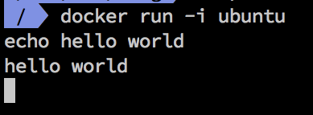
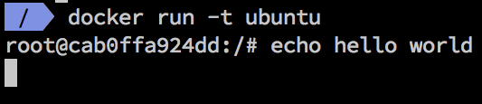
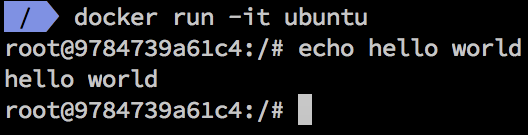
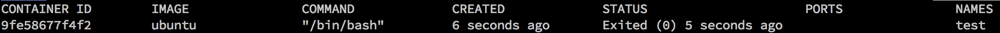
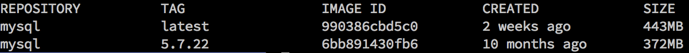
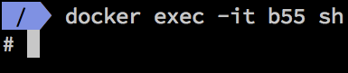

# Dokcer 

- [run](#run)
- [ps](#ps)
- [rm](#rm)
- [rmi](#rmi)
- [images](#images)
- [exec](#exec)

名稱         |說明
----------|----
OPTIONS | docker cli 參數
COMMAND | image 內的cli
CONTAINER|容器
IMAGE|映像檔
ARG|image cli 參數

## Install command completion
[https://docs.docker.com/compose/completion/](https://docs.docker.com/compose/completion/)

---

## run
[doc](https://docs.docker.com/engine/reference/commandline/run/)

建立一個新的容器並運行一個命令

```
docker run [OPTIONS] IMAGE [COMMAND] [ARG...]
```
CLI             | OPTIONS    | IMAGE | COMMAND | ARG            |
-----------|-------------|--------|------------|------------|
docker run| -t -i -d          | ubuntu| echo           | hello world |
```
docker run -t -i -d ubuntu echo hello world
```

####    options
`-i, --interactive`

開啟容器`stdin`也就是説針對容器輸入cli

`--tty , -t	`

容器分配一個虛擬終端

`--detach , -d`

容器放到背景執行

#### example
建立一個`ubuntu容器`後執行`echo`並印出`hello world`後結束容器
```
docker run ubuntu echo hello world
```

開啟容器`stdin`也就是説針對容器輸入cli
```
docker run -i ubuntu 
```


容器分配一個虛擬終端但無法執行cli，因為沒有開`stdin`
```
docker run -t ubuntu 
```


容器分配一個虛擬終端並可執行cli
```
docker run -it ubuntu
```


---

## ps
[doc](https://docs.docker.com/engine/reference/commandline/ps/)

列出所有容器(運行中)

```
docker ps [OPTIONS]
```

CLI             | OPTIONS    | 
-----------|-------------|
docker ps| -a         |

```
docker ps -a
```



output | 說明|
-------|-----|
CONTAINER ID |容器Id
IMAGE|映像檔名稱+tag
COMMAND|執行映像檔內的cli
CREATED|建立時間
STATUS|容器狀態
POSTS|開啟的Port
NAMES|容器名稱

#### options

`--all , -a`

列出所有容器(不管任何狀態)

#### example

---

## rm
[doc](https://docs.docker.com/engine/reference/commandline/rm/)

刪除一個或多個容器

```
docker rm [OPTIONS] CONTAINER [CONTAINER...]
```

CLI             | OPTIONS    | CONTAINER|
-----------|-------------|------------|
docker rm | -f                  | `b0f3044209f6` or `容器名稱` 

```
docker rm b0f3044209f6 9d28f2c3f88c

or

# 容器縮寫
docker rm b0 9d
```

#### options

#### example

---

## rmi
[doc](https://docs.docker.com/engine/reference/commandline/rmi/)

刪除一個或多個映像檔

```
docker rmi [OPTIONS] IMAGE [IMAGE...]
```

CLI             | OPTIONS    | IMAGE|
-----------|-------------|------------|
docker rmi | -f                  | `b0f3044209f6` or `倉庫:tag` 

#### options

#### example

---

## images
[doc](https://docs.docker.com/engine/reference/commandline/images/)

列出所有映像檔

```
docker images [OPTIONS] [REPOSITORY[:TAG]]
```

CLI             | OPTIONS    | [REPOSITORY[:TAG]]|
-----------|-------------|------------|
docker images | -a                  | mysql

```
docker images -a mysql
```


output | 說明|
-------|-----|
REPOSITORY |倉庫名稱
TAG|倉庫TAG
IMAGE ID|映像檔 id
CREATED|建立時間
SIZE|映像檔容量

#### options

`--all , -a`

列出本地所有此倉庫映像檔

#### example

列出本地所有此mysql映像檔
```
docker images -a mysql
```

---

## exec
[doc](https://docs.docker.com/engine/reference/commandline/exec/)

在正在運行的容器中運行命令

```
docker exec [OPTIONS] CONTAINER COMMAND [ARG...]
```

#### options

`-i, --interactive`

開啟容器`stdin`也就是説針對容器輸入cli

`--tty , -t	`

容器分配一個虛擬終端

#### example

將運行中的容器的terminal掛本幾
```
docker ecex -it b55efb2eabc1
```

